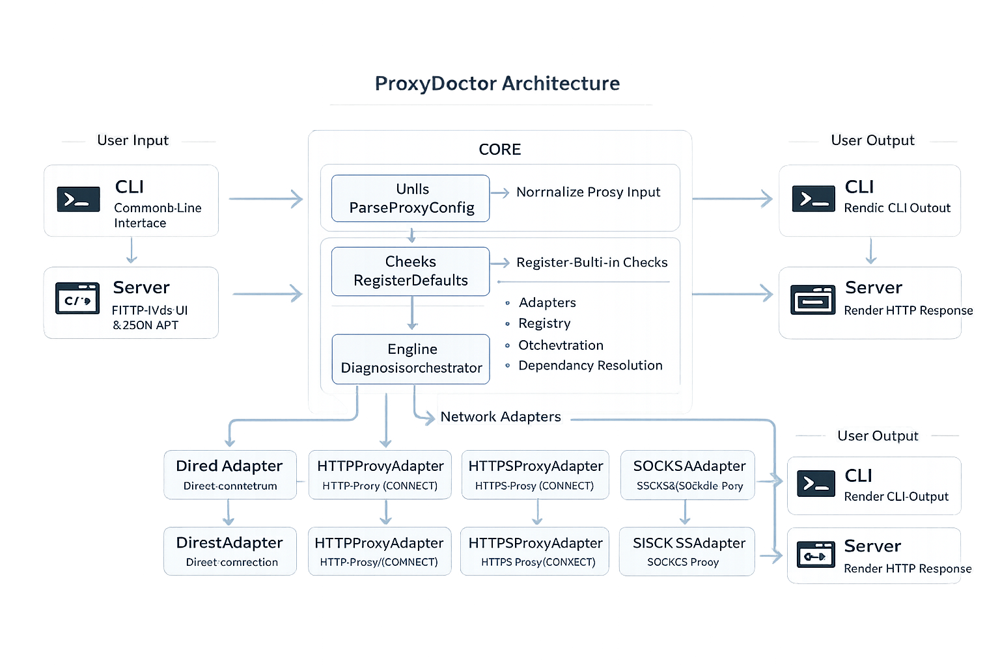

# ProxyDoctor Architecture



ProxyDoctor is a Go CLI and lightweight HTTP UI for diagnosing how a target URL behaves through direct, HTTP, HTTPS, SOCKS4, and SOCKS5 connections.

This document describes the implemented architecture only. Ideas and follow-up work are tracked in `NEXT_STEPS.md`.

## Package layout

```text
cmd/
  cli/                 Cobra-based command line entry point
  server/              Web UI and JSON API over the same diagnosis engine
core/
  adapters/            Direct, HTTP(S), SOCKS4 and SOCKS5 network adapters + dial helpers
  check/               Shared check, result, proxy, HTTP and TLS types
  checks/              Built-in diagnostic checks
  engine/              Registry, dependency ordering and orchestration
  plugin/              In-process extension interfaces and lifecycle manager
  plugins/             Plugin implementations (route_trace, mcp_server, local_proxy)
  utils/               Proxy configuration parsing helpers
internal/
  testproxy/           Hermetic local proxy/origin fixtures used by integration tests
```

## Runtime flow

1. The CLI or server receives a target URL plus optional proxy settings.
2. `core/utils.ParseProxyConfig` normalizes proxy input into `check.ProxyConfig`.
3. `core/checks.RegisterDefaults` registers the built-in checks in `core/engine.CheckRegistry`.
4. If plugins are requested (CLI `--plugins` flag or server auto-loads all), `core/plugins.Load` initializes them via the plugin `Manager`, which calls `Init` and auto-registers any `CheckPlugin` checks.
5. `core/engine.DiagnosisOrchestrator` creates direct/proxy adapters, resolves dependencies and executes the selected checks.
6. Results are returned as `check.CheckResult` values and rendered by the CLI or HTTP server.

## Built-in checks

- `public_ip`: detects and validates the public IP returned by external IP services.
- `dns_resolve`: resolves the target hostname through the selected connection path.
- `tls_certificate`: checks certificate validity, issuer, SANs, public key metadata, TLS version and cipher suite for HTTPS targets.
- `port_connectivity`: tests common TCP ports on the target host.
- `ipv6_leak`: checks whether the system and target support IPv6, compares the system's direct public IPv6 address against the proxy's IPv6 forwarding capability, and reports whether IPv6 traffic can bypass the configured proxy/tunnel.

## Plugin checks

- `route_trace` (plugin ID: `route_trace`): runs a best-effort traceroute and annotates public hops with country information. Loaded via `--plugins route_trace` on the CLI, or automatically by the server.

## Standalone plugins

- `mcp_server` (plugin ID: `mcp_server`): exposes `diagnose`, `compare`, and `list_checks` as MCP (Model Context Protocol) tools via HTTP JSON-RPC 2.0 on `:9090`. Supports both direct POST and SSE (Server-Sent Events) transport. Compatible with OpenCode and other MCP clients. Loaded with `--plugins mcp_server` (no subcommand, blocks until SIGINT).
- `local_proxy` (plugin ID: `local_proxy`): exposes the proxy from `--proxy`/`--proxy-type` as a local forward proxy on `127.0.0.1:8081` (configurable with `--port`/`--host`). Plain HTTP requests are forwarded through the upstream via `adapters.ForwardTransport`; CONNECT requests (HTTPS) are tunneled through `adapters.NewProxyDialContext`. Prints ready-to-copy `curl`/`wget`/browser instructions on startup. Loaded with `--plugins local_proxy`. The same plugin backs the "Start local proxy" control in the web GUI (`cmd/server/localproxy.go`).

## Dial helpers and the local proxy

`core/adapters/dial.go` provides the building blocks that let any plugin route arbitrary traffic through a proxy:

- `DialContextFunc(ctx, network, addr) (net.Conn, error)` — the common dial signature.
- `NewProxyDialContext(config)` — returns a dial function for direct, SOCKS4, SOCKS5 (RFC 1929 auth), or HTTP/HTTPS proxies (via CONNECT).
- `ForwardTransport(config)` — an `http.Transport` that replays outgoing HTTP(S) requests through the proxy.

The local proxy handler (`core/plugins/localproxy/plugin.go`) uses `ForwardTransport` for absolute-form HTTP and `NewProxyDialContext` for CONNECT tunneling, so a browser or `curl -x` pointing at the local proxy can browse through any supported upstream. Test coverage uses the `internal/testproxy` fixtures.

## Network adapters

Every adapter implements `check.NetworkAdapter`:

- `DirectAdapter`: native networking without a proxy.
- `HTTPProxyAdapter`: HTTP proxy support, including CONNECT for tunneled checks.
- `HTTPSProxyAdapter`: HTTPS proxy support, including CONNECT for tunneled checks.
- `SOCKS4Adapter`: SOCKS4/SOCKS4a-style proxy connections.
- `SOCKS5Adapter`: SOCKS5 proxy connections via `golang.org/x/net/proxy`, with RFC 1929 username/password auth and a manual-dialer fallback.

Adapters are exercised by the integration tests in `core/adapters/adapters_integration_test.go`, which use the hermetic fixtures in `internal/testproxy` (local origins, HTTP/HTTPS proxies with auth, SOCKS4/5 proxies with auth).

## Result model

Checks return structured results with:

- status and severity;
- confidence;
- human-readable explanation;
- evidence map;
- probable causes and suggested actions when useful;
- execution time and timestamp.

## Design notes

- Adapter methods return errors instead of hiding failed network operations.
- Checks classify outcomes as `passed`, `failed`, `skipped` or `error`.
- Shared context allows checks to reuse collected evidence such as DNS results or public IP.
- The same engine is used by CLI and server entry points.

## Contributor entry points

- New built-in checks start from `core/check/types.go`, `core/checks/register.go`, and the existing packages under `core/checks/`.
- New plugin checks start from `core/plugin/plugin.go` and `core/plugins/registry.go`. Wrap an existing check or create a new one under `core/plugins/<name>/`.
- Adapter work starts from `core/adapters/`.
- CLI work starts from `cmd/cli/commands/diagnose.go`.
- GUI/API work starts from `cmd/server/main.go`.
- Roadmap issues are mapped to concrete files in `docs/ISSUE_STARTING_POINTS.md`.

